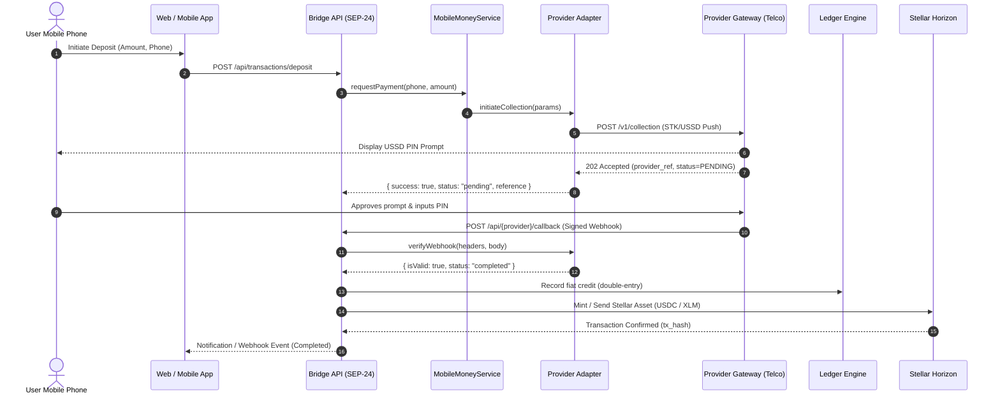
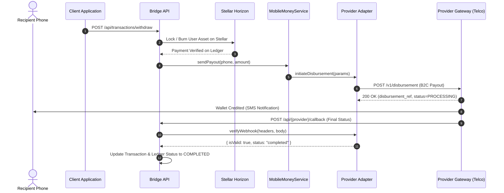
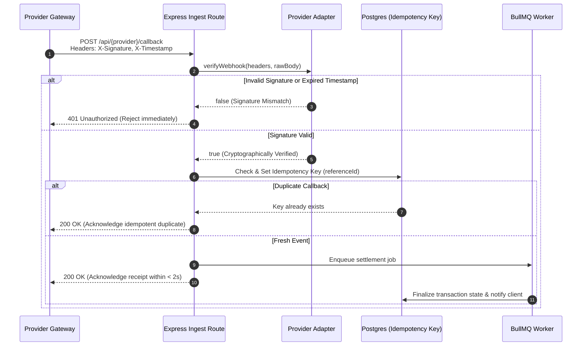

# Provider Integration Runbook & Architecture Guide

A step-by-step technical runbook and architectural specification for integrating new African mobile money provider adapters (e.g., Wave, M-Pesa, Airtel Money, Orange Money, Moov, MTN, Telebirr) into the Mobile Money ↔ Stellar Bridge codebase.

---

## Table of Contents

1. [Architecture Overview](#1-architecture-overview)
2. [End-to-End Sequence Diagrams](#2-end-to-end-sequence-diagrams)
   * [Collection Flow (C2B / Deposit)](#21-collection-flow-c2b--deposit)
   * [Disbursement Flow (B2C / Withdrawal)](#22-disbursement-flow-b2c--withdrawal)
   * [Webhook Signature Verification & Ingestion](#23-webhook-signature-verification--ingestion)
3. [Core Interface Requirements](#3-core-interface-requirements)
   * [initiateCollection()](#31-initiatecollection)
   * [initiateDisbursement()](#32-initiatedisbursement)
   * [verifyWebhook()](#33-verifywebhook)
   * [Status Normalization](#34-status-normalization)
4. [Sample Provider Implementation](#4-sample-provider-implementation)
5. [Step-by-Step Integration Runbook](#5-step-by-step-integration-runbook)
   * [Step 1: Configuration & Secrets Management](#step-1-configuration--secrets-management)
   * [Step 2: Provider Limits & Corridor Registration](#step-2-provider-limits--corridor-registration)
   * [Step 3: Factory Registration (loadProvider)](#step-3-factory-registration-loadprovider)
   * [Step 4: Callback Route & Ingestion Middleware](#step-4-callback-route--ingestion-middleware)
   * [Step 5: Testing & Mock Verification](#step-5-testing--mock-verification)
   * [Step 6: Production Canary Rollout & Rollback](#step-6-production-canary-rollout--rollback)
6. [Operational Checklist](#6-operational-checklist)

---

## 1. Architecture Overview

The Mobile Money Bridge enables bi-directional value exchange between African mobile telecom wallets and the Stellar distributed ledger.

### Architectural Layers

```
┌───────────────────────────────────────────────────────────────┐
│                      Client Layer                             │
│   (SEP-24 Hosted Webviews · Mobile Wallets · Partner SDKs)   │
└──────────────────────────────┬────────────────────────────────┘
                               │ HTTPS / REST / SEP Protocols
┌──────────────────────────────▼────────────────────────────────┐
│                   API Gateway & Middleware                    │
│   Rate Limiting · JWT Auth · Convict Config · Circuit Breakers│
└──────────────────────────────┬────────────────────────────────┘
                               │
┌──────────────────────────────▼────────────────────────────────┐
│                    MobileMoneyService                         │
│   (Provider Router · Idempotency · Failover · Maintenance)    │
└──────────────┬───────────────────────────────┬────────────────┘
               │                               │
┌──────────────▼────────────────┐ ┌────────────▼────────────────┐
│   Provider Adapter Subsystem   │ │  Stellar Horizon & Soroban  │
│  BaseProvider · MTN · Airtel  │ │  Anchor Token Mint/Transfer │
│  Orange · Wave Adapter (New)  │ │  Double-Entry Ledger Engine │
└──────────────┬────────────────┘ └─────────────────────────────┘
               │ Mobile Network APIs (USSD / STK Push / B2C)
┌──────────────▼────────────────────────────────────────────────┐
│             African Telco Gateways & Aggregators              │
│       (MTN Mobile Money, Orange Money, Wave, M-Pesa)          │
└───────────────────────────────────────────────────────────────┘
```

* **`BaseProvider`** (`src/services/providers/baseProvider.ts`): Provides shared credential management, Basic/Bearer header construction, in-memory OAuth2 token caching with expiration leeway, and HTTP timeout handling.
* **`MobileMoneyService`** (`src/services/mobilemoney/mobileMoneyService.ts`): Orchestrates provider routing, maintenance window checks, phone number prefix routing, and circuit breaker protection.
* **`Ledger Engine`** (`src/models/ledger.ts`): Enforces immutable double-entry accounting for all fiat debits and on-chain token releases.

---

## 2. End-to-End Sequence Diagrams

### 2.1 Collection Flow (C2B / Deposit)

In a collection (deposit) flow, fiat is collected from the user's mobile wallet via an interactive USSD prompt or STK Push, verified, and settled on Stellar.



---

### 2.2 Disbursement Flow (B2C / Withdrawal)

In a disbursement (withdrawal) flow, tokens are locked on Stellar, and the bridge calls the mobile provider's payout API to credit the recipient's phone wallet.



---

### 2.3 Webhook Signature Verification & Ingestion

Providers notify the bridge asynchronously via callbacks. All webhooks must be verified cryptographically and processed idempotently.



---

## 3. Core Interface Requirements

Every provider adapter must implement three essential capabilities:

### 3.1 `initiateCollection()`

Initiates a customer-to-business (C2B) push debit from the mobile phone subscriber.

```typescript
export interface CollectionRequest {
  phoneNumber: string;       // E.164 formatted phone number (e.g., +221770000000)
  amount: string;            // Exact amount as string decimal (e.g., "5000.00")
  currency: string;          // ISO-4217 code (e.g., XOF, XAF, KES, GHS)
  referenceId: string;       // Unique internal bridge transaction UUID
  description?: string;      // Transaction memo displayed to subscriber
}

export interface CollectionResult {
  success: boolean;
  providerReference: string; // Remote provider transaction ID
  status: ProviderTransactionStatus; // "pending" | "completed" | "failed"
  rawResponse?: unknown;
  error?: string;
}
```

### 3.2 `initiateDisbursement()`

Transfers funds from the bridge liquidity account to the subscriber's phone wallet (B2C).

```typescript
export interface DisbursementRequest {
  phoneNumber: string;       // Recipient mobile phone number
  amount: string;            // Payout amount
  currency: string;          // Target local currency
  referenceId: string;       // Unique idempotency reference
  recipientName?: string;    // Optional beneficiary name
}

export interface DisbursementResult {
  success: boolean;
  providerReference: string;
  status: ProviderTransactionStatus;
  feeDeducted?: string;
  rawResponse?: unknown;
  error?: string;
}
```

### 3.3 `verifyWebhook()`

Validates cryptographic signature headers (HMAC-SHA256, RSA-SHA256, or Provider Bearer tokens) to reject spoofed webhooks.

```typescript
export interface WebhookVerificationResult {
  isValid: boolean;
  providerReference?: string;
  status?: ProviderTransactionStatus;
  amount?: string;
  currency?: string;
  failureReason?: string;
}

export interface ProviderWebhookHandler {
  verifyWebhook(
    headers: Record<string, string | string[] | undefined>,
    rawBody: string | Buffer
  ): Promise<WebhookVerificationResult> | WebhookVerificationResult;
}
```

### 3.4 Status Normalization

Providers use disparate status strings. Adapters **must** map them to canonical `ProviderTransactionStatus`:

| Raw Provider Status Examples | Canonical Status | Description |
| :--- | :--- | :--- |
| `SUCCESSFUL`, `SUCCESS`, `DELIVERED`, `CONFIRMED` | `"completed"` | Funds successfully moved and verified |
| `PENDING`, `PROCESSING`, `IN_PROGRESS`, `SUBMITTED` | `"pending"` | Waiting for user PIN, network settlement |
| `FAILED`, `REJECTED`, `EXPIRED`, `CANCELLED` | `"failed"` | Permanent failure; can trigger user retry |
| Any unexpected or unknown code | `"unknown"` | Requires automated retry or manual reconciliation |

---

## 4. Sample Provider Implementation

Below is a production-ready reference adapter for **Wave Mobile Money (Senegal / Côte d'Ivoire)** implementing `BaseProvider`, `MobileMoneyProvider`, and webhook verification.

```typescript
import crypto from "crypto";
import axios, { AxiosInstance } from "axios";
import { BaseProvider, ProviderAuthConfig } from "../providers/baseProvider";
import {
  MobileMoneyProvider,
  ProviderTransactionStatus,
} from "./mobileMoneyService";
import logger from "../../utils/logger";

export interface WaveConfig extends ProviderAuthConfig {
  webhookSecret: string;
  currency?: string;
}

export class WaveSenegalProvider extends BaseProvider implements MobileMoneyProvider {
  private readonly client: AxiosInstance;
  private readonly webhookSecret: string;
  private readonly defaultCurrency: string;

  constructor(config: WaveConfig) {
    super(config);
    this.webhookSecret = config.webhookSecret;
    this.defaultCurrency = config.currency || "XOF";

    this.client = axios.create({
      baseURL: this.baseUrl,
      timeout: this.timeoutMs || 10000,
      headers: {
        "Content-Type": "application/json",
      },
    });
  }

  /**
   * OAuth2 / API Token Exchange with Leeway Caching (inherits BaseProvider)
   */
  async getAccessToken(): Promise<string> {
    if (this.isTokenValid()) {
      return this.cachedToken!;
    }

    try {
      const response = await axios.post<{ access_token: string; expires_in: number }>(
        `${this.baseUrl}/v1/oauth/token`,
        { grant_type: "client_credentials" },
        { headers: this.buildOAuth2TokenRequestHeaders() }
      );

      this.cachedToken = response.data.access_token;
      this.tokenExpiresAt = Date.now() + (response.data.expires_in || 3600) * 1000;
      return this.cachedToken;
    } catch (err) {
      logger.error({ err }, "WaveSenegalProvider: Failed to acquire access token");
      throw new Error("Provider authentication failed");
    }
  }

  /**
   * 1. initiateCollection: Prompt user via Wave C2B checkout / push
   */
  async requestPayment(
    phoneNumber: string,
    amount: string,
    requestId?: string
  ): Promise<{ success: boolean; data?: unknown; error?: unknown }> {
    try {
      const token = await this.getAccessToken();
      const payload = {
        amount,
        currency: this.defaultCurrency,
        mobile: phoneNumber,
        client_reference: requestId,
        error_url: `${this.baseUrl}/callback/error`,
        success_url: `${this.baseUrl}/callback/success`,
      };

      const res = await this.client.post("/v1/checkout/sessions", payload, {
        headers: {
          ...this.buildBearerAuthHeader(token),
          "Idempotency-Key": requestId,
        },
      });

      return {
        success: true,
        data: {
          providerReference: res.data.id,
          status: "pending" as ProviderTransactionStatus,
          checkoutUrl: res.data.wave_launch_url,
        },
      };
    } catch (err: any) {
      logger.error({ err: err?.response?.data || err.message }, "Wave collection initiation failed");
      return {
        success: false,
        error: err?.response?.data?.message || err.message,
      };
    }
  }

  /**
   * 2. initiateDisbursement: Send B2C payout to subscriber
   */
  async sendPayout(
    phoneNumber: string,
    amount: string,
    requestId?: string
  ): Promise<{ success: boolean; data?: unknown; error?: unknown }> {
    try {
      const token = await this.getAccessToken();
      const payload = {
        amount,
        currency: this.defaultCurrency,
        mobile: phoneNumber,
        client_reference: requestId,
      };

      const res = await this.client.post("/v1/disbursements", payload, {
        headers: {
          ...this.buildBearerAuthHeader(token),
          "Idempotency-Key": requestId,
        },
      });

      return {
        success: true,
        data: {
          providerReference: res.data.id,
          status: "pending" as ProviderTransactionStatus,
        },
      };
    } catch (err: any) {
      logger.error({ err: err?.response?.data || err.message }, "Wave payout failed");
      return {
        success: false,
        error: err?.response?.data?.message || err.message,
      };
    }
  }

  /**
   * 3. getTransactionStatus: Poll remote status
   */
  async getTransactionStatus(
    referenceId: string
  ): Promise<{ status: ProviderTransactionStatus }> {
    try {
      const token = await this.getAccessToken();
      const res = await this.client.get(`/v1/transactions/${referenceId}`, {
        headers: this.buildBearerAuthHeader(token),
      });

      const rawStatus = String(res.data.status).toLowerCase();
      let status: ProviderTransactionStatus = "unknown";

      if (rawStatus === "succeeded" || rawStatus === "completed") {
        status = "completed";
      } else if (rawStatus === "pending" || rawStatus === "processing") {
        status = "pending";
      } else if (rawStatus === "failed" || rawStatus === "cancelled") {
        status = "failed";
      }

      return { status };
    } catch (err) {
      return { status: "unknown" };
    }
  }

  /**
   * 4. verifyWebhook: Cryptographic HMAC-SHA256 signature verification
   */
  verifyWebhook(
    signatureHeader: string | undefined,
    rawBody: string | Buffer
  ): boolean {
    if (!signatureHeader || !this.webhookSecret) {
      return false;
    }

    try {
      const hmac = crypto.createHmac("sha256", this.webhookSecret);
      hmac.update(rawBody);
      const computedSignature = hmac.digest("hex");

      return crypto.timingSafeEqual(
        Buffer.from(signatureHeader, "utf-8"),
        Buffer.from(computedSignature, "utf-8")
      );
    } catch (err) {
      logger.error({ err }, "Wave webhook signature verification exception");
      return false;
    }
  }
}
```

---

## 5. Step-by-Step Integration Runbook

### Step 1: Configuration & Secrets Management

Add configuration keys in `src/config/appConfig.ts` backed by Convict schema and environment variables. Never commit actual API keys or secrets to git.

```typescript
// Add to Convict schema:
wave: {
  apiKey: {
    doc: "Wave API key or Client ID",
    format: String,
    default: "",
    env: "WAVE_API_KEY",
    sensitive: true,
  },
  apiSecret: {
    doc: "Wave API Secret",
    format: String,
    default: "",
    env: "WAVE_API_SECRET",
    sensitive: true,
  },
  webhookSecret: {
    doc: "Wave Webhook Signing Secret",
    format: String,
    default: "",
    env: "WAVE_WEBHOOK_SECRET",
    sensitive: true,
  },
  baseUrl: {
    doc: "Wave API Base URL",
    format: "url",
    default: "https://api.wave.com",
    env: "WAVE_BASE_URL",
  },
}
```

### Step 2: Provider Limits & Corridor Registration

In `src/config/providers.ts`, register the provider enum and corridor limits:

```typescript
export enum ProviderName {
  MTN = "mtn",
  AIRTEL = "airtel",
  ORANGE = "orange",
  WAVE = "wave", // New provider
}

export const PROVIDER_LIMITS: Record<ProviderName, ProviderLimitConfig> = {
  // ... existing providers
  [ProviderName.WAVE]: {
    minAmount: 100,      // e.g., 100 XOF
    maxAmount: 2000000,  // e.g., 2,000,000 XOF
    supportedCurrencies: ["XOF"],
    supportedCountries: ["SN", "CI"],
  },
};
```

### Step 3: Factory Registration (`loadProvider`)

Register the lazy loader case in `src/services/mobilemoney/mobileMoneyService_impl.js` (or TypeScript factory) to initialize the adapter on-demand:

```javascript
case "wave":
  const { WaveSenegalProvider } = require("./providers/wave");
  return new WaveSenegalProvider({
    apiKey: config.get("wave.apiKey"),
    apiSecret: config.get("wave.apiSecret"),
    webhookSecret: config.get("wave.webhookSecret"),
    baseUrl: config.get("wave.baseUrl"),
  });
```

### Step 4: Callback Route & Ingestion Middleware

1. Create `src/routes/waveCallbacks.ts`.
2. Apply express raw body buffering to preserve the byte-for-byte payload for HMAC verification.
3. Validate and acknowledge within 2000ms:

```typescript
import { Router, Request, Response } from "express";
import { getProvider } from "../services/mobilemoney/mobileMoneyService";

export const waveCallbackRouter = Router();

waveCallbackRouter.post("/callback", async (req: Request, res: Response) => {
  const signature = req.headers["x-wave-signature"] as string;
  const rawBody = (req as any).rawBody || JSON.stringify(req.body);

  const provider = getProvider("wave");
  const isValid = provider.verifyWebhook(signature, rawBody);

  if (!isValid) {
    return res.status(401).json({ error: "Invalid webhook signature" });
  }

  // Fast acknowledgement to prevent provider retries
  res.status(200).json({ received: true });

  // Asynchronously process payment event via transaction worker
  await processProviderEvent("wave", req.body);
});
```

Mount in `src/index.ts`:

```typescript
app.use("/api/wave", waveCallbackRouter);
```

### Step 5: Testing & Mock Verification

1. **Unit Tests**: Mock HTTP responses with Jest / Axios mock adapter to verify request headers, auth token caching, and error formatting.
2. **Provider Mock Server**: Run `npm run provider-mock:dev` to execute end-to-end sandbox flows against local mock servers (`scripts/provider-mock-server.ts`).
3. **Pact Contract Tests**: Run `npm run test:pact` for consumer-driven contract verification.

### Step 6: Production Canary Rollout & Rollback

1. **Canary Enablement**:
   * Deploy code with provider routing disabled in `providerSettingsService`.
   * Enable provider only for test accounts (`is_internal = true`).
   * Run 10 live test transactions on Telco sandbox / production test accounts.
2. **Observability**:
   * Monitor Prometheus metrics: `provider_failover_total{provider="wave"}`, `transaction_errors_total{provider="wave"}`.
   * Verify that p95 response time is `< 3500ms`.
3. **Rollback Strategy**:
   * If error rate exceeds 2%, flip the provider feature flag off in `providerSettingsService` (`status: "maintenance"`).
   * Traffic automatically falls back to secondary provider or returns friendly maintenance response without losing pending transaction records.

---

## 6. Operational Checklist

Before opening a PR for a new provider adapter, verify each item:

* [ ] `initiateCollection()` handles international MSISDN formatting (+221, +237, etc.).
* [ ] `initiateDisbursement()` implements idempotency keys on every payout attempt.
* [ ] `verifyWebhook()` uses `crypto.timingSafeEqual` to avoid timing attacks.
* [ ] Access token caching implements a proactive leeway window (e.g., 30s) to prevent auth storms.
* [ ] No secrets or test credentials are committed to version control.
* [ ] Provider limits, timeouts, and URLs are defined in `appConfig.ts`.
* [ ] Circuit breaker wrapping is tested for connection timeout and HTTP 5xx responses.
* [ ] Sequence diagrams and documentation are updated in `docs/provider_integration_guide.md`.
